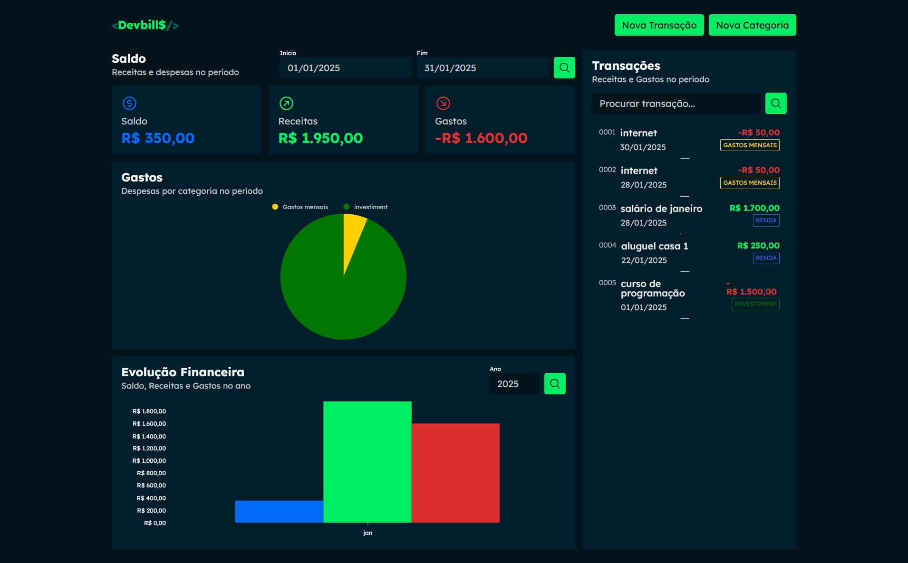

# DevBills

DevBills é uma aplicação completa para gerenciamento de finanças pessoais e profissionais, combinando uma interface intuitiva desenvolvida com **React** e **TypeScript** com uma poderosa API backend personalizada que criei. 

  
🔗Deploy: https://devbills-frontend-bksl8o5gp-allysson-ryans-projects.vercel.app/
  

## 📌 Funcionalidades Planejadas
- **Gerenciamento de transações:** Adicione, edite e exclua receitas ou despesas.
- **Relatórios financeiros:** Visualize gráficos e dashboards para entender sua saúde financeira.
- **Categorias personalizáveis:** Organize transações por categorias específicas.
- **Evolução financeira:** Acompanhe sua performance mês a mês.

---

## 🛠️ Tecnologias Utilizadas
- **React:** Biblioteca para criação de interfaces interativas.
- **TypeScript:** Para um código mais seguro e organizado.
- **Styled-components:** Estilização de componentes com CSS-in-JS.

# Screenshot
Aqui temos a captura de tela do projeto:

